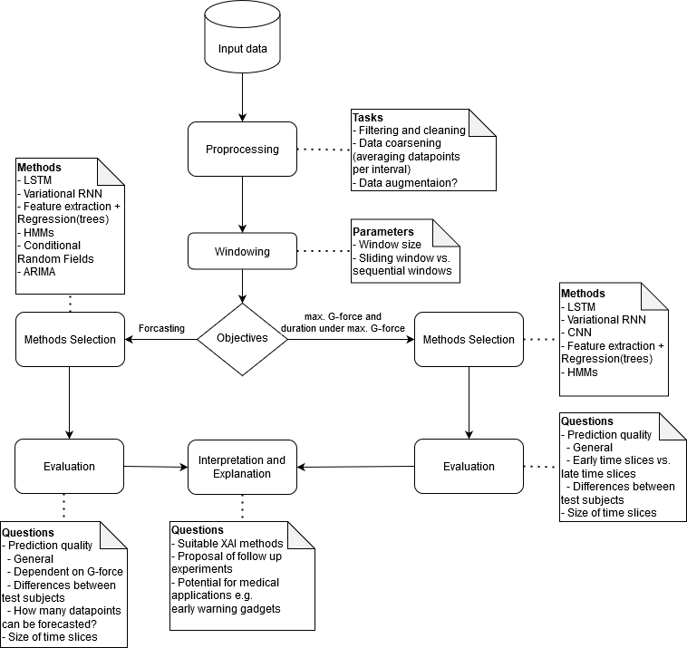

# Table of Contents

[Goal](#goal)

[General Workflow](#workflow)

[Code Documentation](#code)

[Running Notebooks on the HPC-Cluster](#hpc_cluster)

# AI Enabled Autonomous Nervous System Intelligent Monitoring (ANSIM)

<a name="goal"/>

## Goal:
1. Structuring and extracting relevant cardiovascular data sets from recent human studies
2. Development and training of an algorithm to find early marker of developing vasovagal
symptoms

<a name="workflow"/>

## General Workflow
### Preliminary questions:
- Are experiments comparable (duration of g-force phases, total duration of experiments)
- Are test subjects comparable



Data preprocessing:
-	Sample sequences of physiological data extracted by sliding window.
-	Each sequence is annotated by minimum and maximum time stamp

Objectives:
-	Predict performance as the duration of the experiment at maximum G-force 
-	Predict total duration of the experiment.
-	Anomaly detection (Effect of cooling, etc.)

Questions:
-	Feature engineering.
-	Data augmentation (expand dataset by generating artificial sequences e.g. using GANs)
-	Methods
    - Tradidtional ML
    - Neural networks
-	Length of time slices.
-	Predictive power of time slices depending on their timestamps (early samples vs. late samples)
-	Can anomaly detection be used for predictions?
-	Explicability of predictions (Which patterns are good indicators for performance)


<a name="code"/>

## Code Documentation

The code for the *ansim* project depends on three folders: 

- *ansim* python package
- *data* folder containing all the experimental runs from the Medical Aerospace center 
- *notebooks* jupyter notebooks to run experiments

In order to rerun the experiments, you have to add the runs as txt files under *data/Export_SAHC_Testfiles/* and add the description file which describes channel id, signal, description and namem it *BIOPAC01_CHANNEL_ALLOCATION_DESC.txt*.


- *ansim* python package contents and mapping to  *jupyter notebooks*: 
    - Note: make sure to have the correct paths in the file *properties.py*
    #### loader.py
    - loader.py: is tailored for the ansim dataset. It is responsible for cleaning up the data (removing small files), loading a run and plotting its results, converting all txt files to csv (this is mandatory for training the models later on). You can check the jupyter notebook, *notebooks/loader.ipynb* that uses the loader.py for examples.

    #### window_dataset.py
    - window_dataset.py: This python file has the class `WindowDataset()` - It is responsible for windowing the dataset, given X and y. An example of the WindowDataset is below. Note that this class is used by the class below, `Preprocessor()`:

        ```python

        # set windowed dataset
        windowed = ansim.window_dataset.WindowDataset()
        windowed.window_size = 3000 # Number of steps in a run : e.g. 3000 is equivalent to 3000 entries in each run
        windowed.shift = 1000 # number of steps to shift to build the next instance
        windowed.batch_size = 256 # each batch will have 256 instances where each instance will contain 3000 steps
        windowed.shuffle_buffer = 5000

        data_preprocessor.windowDataset= windowed
        ```
        - Check jupyter notebook *notebooks/gzforce_tolerance_models.ipynb* for usage example.

    #### preprocessor.py
    - preprocessor.py: this python file has the main class `Preprocessor()`. This class is used to preprocess the experimental runs in order to used them for training machine learning models. 
        -  Note: make sure to run this before - the `Preprocessor()` uses the csv format for the runs
                    ` loader.convert_runs_to_csv()  `
        - An example of the Preprocessor:

            ```python
            
            data_preprocessor = ansim.preprocessor.Preprocessor()


            # the columns for X and y
            data_preprocessor.x_columns= [  'electrocardiogram_signal', 'noininvasible_blood_pressure',
                                            'G-force_z_axis', 'blood_pressure_systolic_value']
            data_preprocessor.y_columns= [ 'max_gz', 'tolerance']

            data_preprocessor.omit_baseline = True # a run that has a max gforce <= 0.75 is dismissed
            data_preprocessor.train_split= 0.7 # 70% training set and 30 test set
            data_preprocessor.split_by= ansim.preprocessor.Preprocessor.SPLIT_BY_SUBJECT # this can be SPLIT_BY_SUBJECT or SPLIT_BY_RUN

            # set windowed dataset
            windowed = ansim.window_dataset.WindowDataset()
            windowed.window_size = 3000
            windowed.shift = 1000
            windowed.batch_size = 256
            windowed.shuffle_buffer = 5000

            data_preprocessor.windowDataset= windowed
            ```
        - Check jupyter notebook *notebooks/gzforce_tolerance_models.ipynb* for usage example.

    #### dnn.py
    - dnn.py: this python file has the main class `GenericModel()`. And the two models `SequentialModel(GenericModel)` and `Lstm(GenericModel)`:
        - `SequentialModel(GenericModel)` implements a simple 3 layer sequential model - usage example:
            ```python
            # Initializing the Sequential Model
            sequential_model = ansim.dnn.SequentialModel(dataset_train, dataset_test,
                                                        input_shape_instances= data_preprocessor.windowDataset.window_size,
                                                        input_shape_features = len(data_preprocessor.x_columns))

            sequential_model.lr=0.1
            sequential_model.epochs=100
            sequential_model.loss = "mse"
            sequential_model.metrics = ["mse", "mae"]

            # train
            sequential_model.train()

            # evaluate on the test set
            sequential_model.evaluate()
            
            ```

        - `Lstm(GenericModel)` implements a Biderectional LSTM model - It has a function to tune the learning rate in addition to train/evaluate - usage example:
            ```python
                lstm_model = ansim.dnn.Lstm(dataset_train, dataset_test,
                            input_shape_instances= data_preprocessor.windowDataset.window_size,
                            input_shape_features = len(data_preprocessor.x_columns))

                 
                lstm_model.lr=0.1
                lstm_model.epochs=500
                lstm_model.metrics = ["mse", "mae"]

                # train
                history = lstm_model.train()

                # evaluate
                lstm_model.evaluate()
            ```
        - Check jupyter notebook *notebooks/gzforce_tolerance_models.ipynb* for usage example.

    #### utils.py
    - utils.py: contains generic helper functions.

<a name="hpc_cluster"/>

## Running Notebooks on the HPC-Cluster

### Setup: miniconda, tensorflow, pandas, scikit and jupyter
Sidenote: You may need to initialize your shell while setting up conda, follow the on screen instructions and it should work.

* SSH onto the cluster with ```ssh <USER_NAME>@fe-store01.sc.bs.dlr.de```
* Load the Miniconda2 Module with ```module load miniconda2/miniconda2-4.7.12.1/miniconda2-4.7.12.1-gcc-10.2.0-tpknuns```
* Create a conda environment ```conda create --name <YOUR_ENV_NAME> python=3.8.5``` (this creates a conda env that uses python 3.8.5)
* Activate it ```conda activate <YOUR_ENV_NAME>```
* Install tensorflow, pandas and scikit ```conda install tensorflow-gpu``` ```conda install pandas``` ```conda install -c conda-forge scikit-learn``` ```conda install jupyter```
#### Starting the jupyter notebook server and accessing it from your browser
* After the initial setup, you don't need to load the miniconda module, you can type ```conda activate <YOUR_ENV_NAME>``` to activate your environment
* On the Cluster: Start the jupyter notebook server with ```srun -p gpu -t <TIME_OUT> jupyter notebook --no-browser --port=8008```
(We should write down who is using which port, to avoid mix-ups. Later we could also discuss running just one "group" notebook server.)
* On your local machine: Enable port forwarding with ```ssh -L localhost:8888:localhost:8008 <USER_NAME>@be-gpu01.sc.bs.dlr.de -v -v``` Here you may have to adapt the second port. In general, both ports are customizable.

You should be able to access the notebook via your browser on ```http://localhost:8888/```. (You may need a token to access it, the token should be listed in the shell running the notebook).
You have to specify a timeout when using srun, otherwise SLURM will kill the process after (I think) half an hour.
One proposed workflow (for training a network) could be: Run the notebook without a timeout, start the training, check how long one epoch takes, calculate the time needed for training, set the timeout accordingly (+ buffer).

!!! You should also use a screen session or SBATCH to avoid srun from terminating when your ssh connection times out (At least for the jupyter server) !!!

When using screen: Keep in mind to kill/quit the screen sessions afterwards, to avoid unused screens running in the background.
Screen usage example:  
```ssh <USER_NAME>@fe-store01.sc.bs.dlr.de```  
```screen```  
```conda activate <YOUR_ENV_NAME>```  
```srun -p gpu -t <TIME_OUT> jupyter notebook --no-browser --port=8008```  
Afterwards you can press ctrl+a and d to detach from the screen, and ```screen -r``` to reattach.

### GIT Setup and locating the dataset
If this is your first time on the cluster, you won't have a $HOME folder. (I got mine approx. 1 hour after my first login)
Afterwards clone the git into your home. The Dataset is currently on ```/scratch/kone_ka/ansim/data/```. You may have to adjust the path in your code accordingly. (You should have access to it, if not please tell me)

